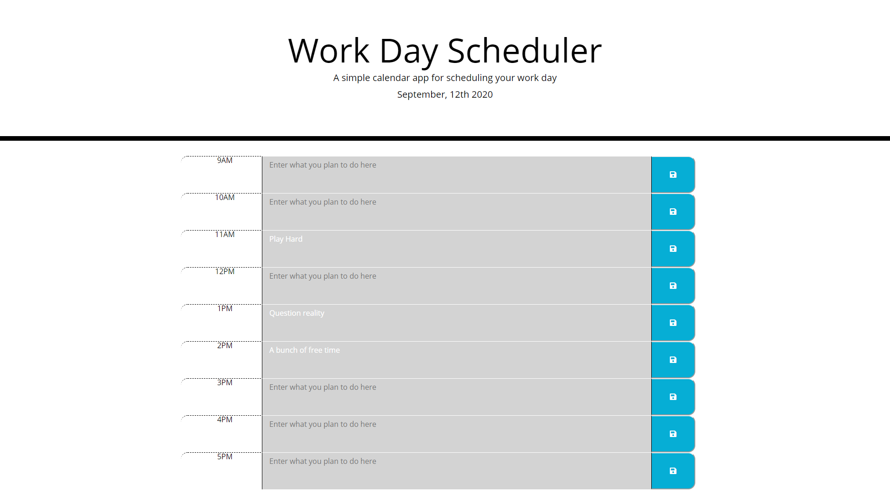

# Busy-Work-Scheduler

A work day planner for those who need that sort of thing.

## Preview

## Where to access

If you need your work day planned out come here: [Work Day Planner](https://mbpjason.github.io/128-Character-Password-Generator/)

## How to use

Choose a time slot. When you have chosen your time slot write in the text field that it is next to and input what ever you plan to do. After you enter your todo for that time hit the save button right next to that field to save that exact field the button is next to.

## Clean Code

This was made with clear direct code explaining what code section is doing what, with clear variables dictating what each variable is for. This page was made dynamically with JS. If you need to change parts you can easily update whatever parts without being confused as what part you are affecting.

## How it Works

It use a forEach loop to loop over an array of chosen time slots. Then use it call back functions an refresh that specific using the array for a time "sync" against mommentjs provided data.